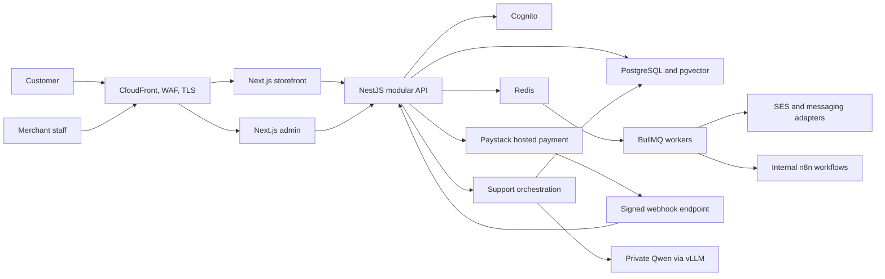
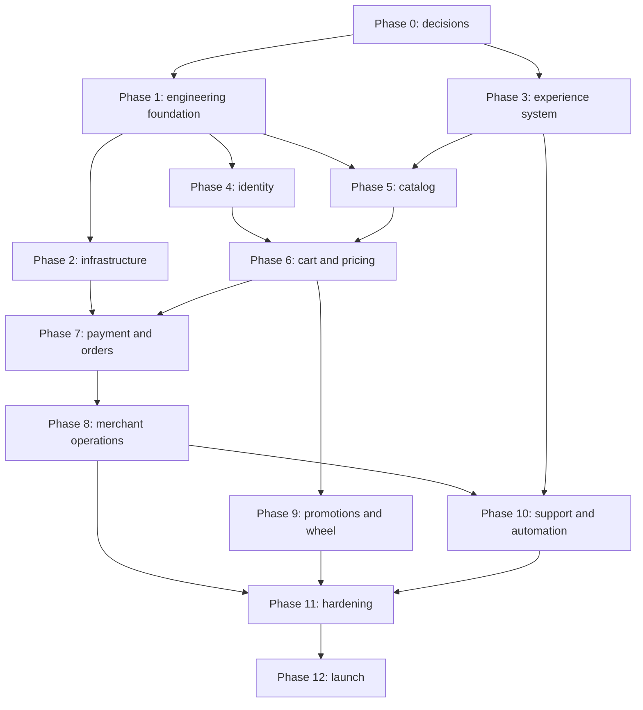

# Threads of Gold: Atomic Implementation Roadmap

Status: planning baseline
Primary market: Ghana
Engineering baseline: production practices commonly expected in Germany and the EU
Delivery target: customer-ready and merchant-operable ecommerce platform

## 1. Outcome and launch definition

Threads of Gold is complete for initial public release only when all three operating views work together.

### Customer-ready

- Customers can browse fast, accessible product and collection pages on mobile and desktop.
- Customers can use guest checkout or create a verified account.
- Customers can select valid variants, see stock status, use a persistent cart, and receive server-calculated totals.
- Customers in Ghana can pay in GHS through Paystack using supported cards or Mobile Money.
- Customers receive an order confirmation and can view order and fulfillment status.
- Eligible new customers can receive a server-issued promotional-wheel discount under published terms.
- Customers can receive grounded automated support and escalate to a human.

### Merchant-ready

- Authorized staff can manage products, variants, inventory, prices, promotions, orders, refunds, fulfillment, and support cases.
- The merchant receives reliable order and payment notifications.
- Payment, order, inventory, fulfillment, promotion, and refund changes have an audit trail.
- Staff can recover failed notifications and webhook processing without editing the database manually.

### Operations-ready

- Development, staging, and production are reproducible with Terraform and automated delivery pipelines.
- Production has monitoring, alerting, encrypted backups, restore procedures, security controls, and incident runbooks.
- Ghana privacy, tax, invoicing, promotional, consumer, and payment obligations have been reviewed by qualified local professionals.
- No critical or high-severity launch findings remain open.

## 2. Selected technical baseline

| Concern             | Selection                                        | Boundary                                                             |
| ------------------- | ------------------------------------------------ | -------------------------------------------------------------------- |
| Primary language    | TypeScript                                       | Storefront, admin, API, workers, contracts, and automation adapters  |
| Storefront          | Next.js App Router and React                     | Server Components by default; Client Components only for interaction |
| Merchant UI         | Next.js App Router                               | Separately authorized admin application                              |
| Component system    | shadcn/ui, Radix UI, Tailwind CSS                | Owned, tokenized, accessible reusable components                     |
| UI organization     | Atomic Design plus feature/domain modules        | Atomic Design applies to reusable UI, not business logic             |
| Backend             | NestJS modular monolith                          | Domain-oriented modules with explicit interfaces                     |
| API                 | Versioned REST and OpenAPI                       | Generated client plus Zod validation at trust boundaries             |
| Data                | PostgreSQL, Prisma, pgvector                     | Transactions, migrations, audit records, and support retrieval       |
| Cache and jobs      | Redis and BullMQ                                 | Cache, rate limits, retries, schedules, and background jobs          |
| Identity            | Amazon Cognito                                   | Verified customer identity, secure sessions, staff MFA               |
| Payments            | Paystack hosted/redirect flow                    | GHS cards and Ghana Mobile Money; no raw payment credentials stored  |
| Media               | Amazon S3 and CloudFront                         | Product media and CDN delivery                                       |
| Transactional email | Amazon SES                                       | Account, order, fulfillment, refund, and staff notifications         |
| Infrastructure      | AWS `eu-central-1` and Terraform                 | Frankfurt deployment with documented Ghana cross-border processing   |
| Runtime             | ECS Fargate, RDS, ElastiCache                    | Containerized web, API, and worker services                          |
| Delivery            | GitHub Actions and Renovate                      | Tested builds, plans, scans, deployments, and dependency updates     |
| Business automation | Self-hosted n8n                                  | Non-critical internal merchant workflows only                        |
| AI development      | Ollama                                           | Local open-weight model development                                  |
| AI production       | vLLM with Qwen3-8B                               | Private inference endpoint; model weights are free, compute is not   |
| Retrieval           | Qwen3 Embedding and pgvector                     | Answers grounded in approved store knowledge                         |
| Observability       | OpenTelemetry, Sentry, CloudWatch                | Correlated logs, traces, errors, metrics, uptime, and alerting       |
| Testing             | Vitest/Jest, Testcontainers, Playwright, axe, k6 | Unit through production-like user journeys                           |

Architecture decisions remain replaceable behind interfaces. Payment, messaging, authentication, storage, search, and LLM providers must not leak into domain logic.

## 3. System shape



## 4. Repository target

```text
threadsofgold/
|-- apps/
|   |-- storefront/          # Customer Next.js application
|   |-- admin/               # Merchant Next.js application
|   |-- api/                 # NestJS HTTP API and webhooks
|   `-- worker/              # NestJS application context and BullMQ jobs
|-- packages/
|   |-- ui/                  # Atomic shadcn design system
|   |-- contracts/           # Zod schemas and API types
|   |-- database/            # Prisma schema, migrations, seeds
|   |-- auth/                # Cognito integration and authorization helpers
|   |-- observability/       # Logging, tracing, metrics, redaction
|   |-- eslint-config/
|   |-- typescript-config/
|   `-- test-utils/
|-- infrastructure/
|   |-- bootstrap/           # Remote Terraform state and account bootstrap
|   |-- modules/             # Reusable Terraform modules
|   `-- environments/        # Development, staging, production roots
|-- automation/
|   `-- n8n/                 # Exported, reviewed workflow definitions
|-- docs/
|   |-- adr/                 # Architecture decision records
|   |-- compliance/          # Processing register and evidence index
|   |-- runbooks/            # Operations and incident procedures
|   `-- threat-models/
`-- .github/workflows/
```

The initial backend is a modular monolith. Splitting it into microservices is prohibited until measured scaling, ownership, or release-coupling evidence justifies the operational cost.

## 5. Capability map

| ID     | Capability                       | Launch result                                                    | Priority     |
| ------ | -------------------------------- | ---------------------------------------------------------------- | ------------ |
| CAP-01 | Product governance               | Approved scope, decisions, risks, and measurable requirements    | P0           |
| CAP-02 | Engineering platform             | Reproducible monorepo, environments, quality gates, and delivery | P0           |
| CAP-03 | Experience system                | Premium, accessible, responsive design system and content        | P0           |
| CAP-04 | Identity and access              | Customer accounts, guest checkout, staff MFA, and RBAC           | P0           |
| CAP-05 | Catalog and inventory            | Products, variants, collections, media, stock, and search        | P0           |
| CAP-06 | Cart, pricing, tax, and shipping | Server-authoritative purchasable basket in GHS                   | P0           |
| CAP-07 | Payments and orders              | Verified Paystack payment-to-order state machine                 | P0           |
| CAP-08 | Fulfillment and communication    | Merchant notification, fulfillment, refund, and customer updates | P0           |
| CAP-09 | Merchant operations              | Safe product, order, promotion, and support administration       | P0           |
| CAP-10 | Promotions and wheel             | Scheduled discounts and abuse-resistant new-user wheel           | P0           |
| CAP-11 | Support and AI                   | Grounded automated help with authenticated escalation            | P1 before GA |
| CAP-12 | Business automation              | Retryable non-critical internal workflows                        | P1 before GA |
| CAP-13 | Analytics and growth             | Consent-aware funnel, operational, and promotion measurement     | P0           |
| CAP-14 | Security and privacy             | Ghana-first compliance and OWASP-aligned controls                | P0           |
| CAP-15 | Reliability and operations       | Monitoring, backups, restore, reconciliation, and runbooks       | P0           |
| CAP-16 | Quality and launch               | Automated verification, UAT, rollout, and stabilization          | P0           |

P0 is required to accept ordinary public orders. P1 before GA may launch behind a feature flag during the controlled-release period. P2 improvements are intentionally excluded until production evidence exists.

## 6. Feature milestone roadmap

```mermaid
flowchart LR
    M0["M0: Decisions ready"] --> M1["M1: Walking skeleton"]
    M1 --> M2["M2: Premium showroom"]
    M2 --> M3["M3: Purchasable cart"]
    M3 --> M4["M4: Money path proven"]
    M4 --> M5["M5: Merchant operations"]
    M5 --> M6["M6: Promotions and wheel"]
    M6 --> M7["M7: Support and automation"]
    M7 --> M8["M8: Release candidate"]
    M8 --> M9["M9: Controlled live release"]
    M9 --> M10["M10: General availability"]
```



| Milestone                  | Demonstrable outcome                                                                                    | Gate                                                                     |
| -------------------------- | ------------------------------------------------------------------------------------------------------- | ------------------------------------------------------------------------ |
| M0 Decisions ready         | Business, Ghana payment, tax, privacy, shipping, architecture, and scope decisions approved             | No unresolved decision blocks schema or checkout                         |
| M1 Walking skeleton        | One traced request travels through deployed storefront, API, database, worker, and notification sandbox | CI, Terraform plan, deployment, rollback, and observability work         |
| M2 Premium showroom        | Real products can be managed and browsed through accessible, indexed pages                              | Catalog and design acceptance tests pass                                 |
| M3 Purchasable cart        | Guest and signed-in customers can create a server-priced, persistent cart                               | Concurrency, stock, pricing, and cart recovery tests pass                |
| M4 Money path proven       | Paystack test payment creates exactly one paid order and notification                                   | Signed-webhook, verification, idempotency, and reconciliation tests pass |
| M5 Merchant operations     | Staff can fulfill, cancel, and refund orders with customer updates                                      | RBAC, audit, fulfillment, and recovery tests pass                        |
| M6 Promotions and wheel    | Merchant schedules offers; eligible new customers receive one bounded prize                             | Probability, eligibility, legal, expiry, and abuse tests pass            |
| M7 Support and automation  | Grounded support answers approved questions and routes uncertain cases                                  | Evaluation, privacy, escalation, and kill-switch tests pass              |
| M8 Release candidate       | Production-like system passes security, accessibility, load, recovery, and UAT                          | Signed launch checklist; no critical/high findings                       |
| M9 Controlled live release | Limited customers place real low-risk orders under close monitoring                                     | Real payment, fulfillment, refund, alert, and rollback verified          |
| M10 General availability   | Store is publicly discoverable and merchant can operate it independently                                | Stabilization metrics and handover accepted                              |

## 7. Phase plan and atomic work packages

An atomic work package should normally be reviewable in one pull request, have one primary outcome, and include its verification. A package is not complete when code merely compiles.

### Phase 0: Discovery, governance, and decisions

**Purpose:** remove business, legal, and architectural ambiguity before implementation.
**Capabilities:** CAP-01, CAP-14
**Milestone:** M0

- [ ] P0.01 Record the Ghanaian legal business name, registration identifiers, address, responsible contacts, and settlement bank owner.
- [ ] P0.02 Define launch countries, delivery regions, excluded locations, primary currency, and language.
- [ ] P0.03 Inventory product categories, variants, SKUs, prices, stock, weights, dimensions, materials, care instructions, and imagery.
- [ ] P0.04 Define stock ownership, reservation policy, oversell policy, backorder policy, and stock-adjustment authority.
- [ ] P0.05 Define shipping origins, providers, service levels, rates, free-shipping rules, and failed-delivery handling.
- [ ] P0.06 Confirm Paystack Ghana merchant eligibility, settlement, fees, test access, GHS, cards, MTN MoMo, Telecel, and ATMoney requirements.
- [ ] P0.07 Define cancellation, return, exchange, refund, chargeback, damaged-item, and lost-delivery policies.
- [ ] P0.08 Obtain Ghana tax advice on registration threshold, VAT/NHIL/GETFund treatment, receipt fields, record retention, and electronic invoicing.
- [ ] P0.09 Register or plan registration with Ghana's Data Protection Commission and identify the controller, processors, recipients, and transfer locations.
- [ ] P0.10 Obtain legal review for privacy, cookies, terms, promotions, wheel odds, marketing consent, and customer communications.
- [ ] P0.11 Decide data residency and document why AWS Frankfurt is selected, including safeguards for processing outside Ghana.
- [ ] P0.12 Define customer, support, operations, and administrator roles and least-privilege permissions.
- [ ] P0.13 Map the browse, cart, checkout, order, fulfillment, return, support, and promotion journeys.
- [ ] P0.14 Define launch KPIs: conversion, payment success, fulfillment time, support escalation, availability, and error budget.
- [ ] P0.15 Define non-functional targets for Core Web Vitals, WCAG 2.2 AA, uptime, RPO, RTO, throughput, and supported devices.
- [ ] P0.16 Create the P0/P1/P2 feature scope and explicit non-goals.
- [ ] P0.17 Approve ADRs for the monorepo, modular monolith, AWS, Cognito, Paystack, Terraform, n8n boundary, and open-weight LLM boundary.
- [ ] P0.18 Build a risk register with owner, likelihood, impact, mitigation, and review date.

**Exit gate:** business owner, engineering owner, accountant, and legal/privacy reviewer have approved all decisions that affect money, customer data, shipping, and promotions.

### Phase 1: Repository and engineering foundation

**Purpose:** create a predictable development system before feature code.
**Capabilities:** CAP-02, CAP-14, CAP-15
**Milestone:** first half of M1

Implementation note (2026-08-30): the repository policy, CODEOWNERS file, pull-request template, pinned Node version, and initial `Quality` workflow are implemented. Pull request #2 passed the remote `Quality` workflow, and `main` protection was verified with pull requests, the strict `Quality` check, conversation resolution, administrator enforcement, and force-push and deletion blocking required. P1.01 is complete for the current single-maintainer model. Approval and CODEOWNERS enforcement must be enabled when a second maintainer is added. P1.11 remains open until the remaining test, infrastructure, and security jobs are delivered.

Implementation note (2026-08-30, P1.02-P1.06): pull request #3 delivers pnpm workspaces and Turborepo; separate storefront, admin, API, and worker applications; the shared UI, contracts, database, auth, observability, configuration, lint, TypeScript, and test-utility package boundaries; strict TypeScript and zero-warning lint/format/import controls; and fail-fast, redacted environment validation with four committed secret-free examples. Its initial remote `Quality` run passed after frozen installation, and focused local probes verified API HTTP startup, worker startup, strict cache declarations, required configuration, loopback-safe defaults, rejected invalid ports and stages, and rejected malformed, local, or insecure deployed origins without echoing submitted values. P1.07 and later Phase 1 items remain open.

Implementation note (2026-08-31, P1.07-P1.17): pull request #4 completes the remaining engineering foundation with correlated and redacted observability; versioned OpenAPI and a generated, status-aware client; unit, contract, Testcontainers, Playwright, axe, and k6 foundations; clean-clone build and test gates; dependency, secret, license, source, container, CodeQL, and software-bill-of-material controls; Renovate policy validation; local PostgreSQL, Redis, Mailpit, and Paystack-compatible mock services; governance templates; deployable health, readiness, and version endpoints; and a protected synthetic walking skeleton. Local execution verified service health, denial without the verifier token, an idempotent request identifier, PostgreSQL persistence, Redis-backed worker delivery, Mailpit capture, and end-to-end ULID correlation. The required remote `Quality` workflow verifies the clean Linux install, generation, tests, builds, security controls, runtime images, and browser journeys before merge. Terraform validation is discovery-only until Phase 2 introduces `.tf` roots. This milestone does not claim a deployed environment or any production commerce capability.

- [x] P1.01 Define branch protection, conventional commits, CODEOWNERS, pull-request template, review requirements, and release policy.
- [x] P1.02 Initialize pnpm workspaces and Turborepo with pinned Node and pnpm versions.
- [x] P1.03 Create `storefront`, `admin`, `api`, and `worker` applications.
- [x] P1.04 Create shared UI, contracts, database, auth, observability, lint, TypeScript, and test packages.
- [x] P1.05 Enable strict TypeScript, import boundaries, unused-code checks, formatting, and linting.
- [x] P1.06 Add environment schema validation and committed `.env.example` files with no secrets.
- [x] P1.07 Configure structured JSON logging, correlation IDs, redaction, OpenTelemetry, and Sentry release identifiers.
- [x] P1.08 Create an API versioning convention and generate OpenAPI in CI.
- [x] P1.09 Generate the typed API client and fail CI when the generated contract is stale.
- [x] P1.10 Configure Vitest/Jest, Testcontainers, Playwright, axe, and k6 foundations.
- [x] P1.11 Add GitHub Actions jobs for lint, typecheck, unit, integration, contract, build, image, Terraform validation, and security scans.
- [x] P1.12 Add dependency, secret, license, container, and software-bill-of-material scans.
- [x] P1.13 Configure Renovate with grouped low-risk updates and manual review for major, auth, payment, and infrastructure changes.
- [x] P1.14 Add local container dependencies for PostgreSQL, Redis, email capture, and Paystack-compatible mocks.
- [x] P1.15 Add ADR, threat-model, runbook, and compliance evidence templates.
- [x] P1.16 Create health, readiness, and version endpoints for every deployable service.
- [x] P1.17 Prove a local request from storefront to API to database and worker.

**Exit gate:** a clean clone can install, test, build, start, and exercise the walking skeleton from documented commands.

### Phase 2: Infrastructure and delivery foundation

**Purpose:** deploy the walking skeleton reproducibly and safely.
**Capabilities:** CAP-02, CAP-14, CAP-15
**Milestone:** M1

Implementation note (2026-08-31, P2.01 preparation): the repository now defines a draft, secret- and live-ID-free six-account AWS Organizations and Control Tower topology; dedicated development, staging, and production workload boundaries; management/core-account no-workload rules; a day-zero management/member-root and non-root bootstrap policy; Control Tower OU baseline and account-enrollment requirements; an explicit managed organization-trail choice; separate home, governed, and workload Region decisions plus a required Region-deny strategy; protected environment mapping interfaces; deterministic structural and resolved mapping-consistency validation; unit tests; and required CI enforcement. This is design and validation evidence only. P2.01 remains open until ADR-0001 and the P0.11/P0.17 dependencies are approved, business-controlled account ownership, root/primary-contact custody, shared-account selection, logging and billing authority are recorded outside Git, the landing zone, OU baselines, account enrollment, centralized member-root administration, and root-use monitoring are established, and controlled landing-zone/drift, Organizations, Control Tower, root-policy, contact, trail, successful role-assumption, caller-identity, and all-Region resource-inventory evidence verifies the intended boundaries. No AWS account, Terraform root, or deployed environment is claimed by this note.

- [ ] P2.01 Establish separate AWS accounts or strongly isolated environments for development, staging, and production.
- [ ] P2.02 Enable MFA, least-privilege roles, CloudTrail, cost budgets, and security contacts.
- [ ] P2.03 Bootstrap encrypted remote Terraform state and state locking outside application stacks.
- [ ] P2.04 Define provider versions, module versioning, naming, tagging, and environment conventions.
- [ ] P2.05 Create Terraform modules for networking, security groups, ECS, load balancing, ECR, RDS, Redis, S3, CloudFront, WAF, DNS, certificates, SES, Cognito, secrets, monitoring, and backups.
- [ ] P2.06 Provision a private VPC with only load balancers and approved edge entry points public.
- [ ] P2.07 Provision encrypted PostgreSQL with automated backups, point-in-time recovery, parameter monitoring, and deletion protection in production.
- [ ] P2.08 Provision encrypted Redis with authentication, private networking, and production failover appropriate to the agreed RTO.
- [ ] P2.09 Provision immutable container registries with scanning and retention policies.
- [ ] P2.10 Provision product-media buckets with blocked public access, lifecycle rules, signed administration, and CloudFront delivery.
- [ ] P2.11 Provision storefront, admin, API, and worker services with least-privilege runtime roles.
- [ ] P2.12 Provision Cognito customer and staff authentication configuration, keeping staff MFA mandatory.
- [ ] P2.13 Provision Secrets Manager entries and rotation ownership; never place values in Terraform state variables unnecessarily.
- [ ] P2.14 Configure domain, TLS, HSTS, WAF managed rules, bot/rate controls, and origin restrictions.
- [ ] P2.15 Verify SES identity, SPF, DKIM, DMARC, bounce, complaint, and suppression handling.
- [ ] P2.16 Create dashboards and alerts for availability, latency, errors, queue depth, database, Redis, payment webhooks, and cost anomalies.
- [ ] P2.17 Add preview/staging deployment and production deployment with protected environment approval.
- [ ] P2.18 Add forward-only database migration and documented rollback/roll-forward procedures.
- [ ] P2.19 Run the first backup restore into an isolated environment and record evidence.
- [ ] P2.20 Prove deployment rollback and service recovery without data loss.

**Exit gate:** M1 works in staging; Terraform plan is reviewed; secrets remain external; deployment, rollback, alerts, and restore are proven.

### Phase 3: Brand, content, and experience system

**Purpose:** create the premium visual system and all reusable states before assembling pages.
**Capabilities:** CAP-03
**Milestone:** foundation for M2

- [ ] P3.01 Approve audience, positioning, tone, visual direction, logo usage, photography, and competitor references.
- [ ] P3.02 Define sitemap, navigation, URL strategy, search behavior, and page inventory.
- [ ] P3.03 Create mobile-first wireframes for home, collections, product, search, cart, checkout handoff, account, order, support, policies, and admin.
- [ ] P3.04 Define semantic design tokens for color, type, space, radius, shadow, motion, breakpoints, and focus.
- [ ] P3.05 Configure Tailwind from semantic tokens; prohibit repeated arbitrary values where a token exists.
- [ ] P3.06 Import and adapt shadcn primitives into owned `packages/ui` components.
- [ ] P3.07 Build accessible atoms: text, link, button, icon button, input, select, checkbox, badge, price, divider, skeleton, and spinner.
- [ ] P3.08 Build molecules: form field, quantity selector, money display, search field, variant option, stock label, notification item, and address summary.
- [ ] P3.09 Build organisms: header, footer, product card, gallery, filters, cart drawer, account navigation, order summary, support panel, and wheel shell.
- [ ] P3.10 Build page templates with loading, empty, error, offline, unauthorized, sold-out, and maintenance states.
- [ ] P3.11 Add Storybook or equivalent component documentation with interaction and accessibility tests.
- [ ] P3.12 Add reduced-motion, high-contrast, keyboard, touch-target, zoom, and screen-reader requirements.
- [ ] P3.13 Produce final product copy, homepage copy, size/care guides, FAQs, contact information, and policy copy.
- [ ] P3.14 Produce optimized product imagery with dimensions, crops, alt text, rights, and source records.
- [ ] P3.15 Conduct prototype testing with representative Ghanaian mobile customers and merchant staff.
- [ ] P3.16 Resolve findings and record design acceptance.

**Exit gate:** approved design and content cover every state needed by the P0 customer and merchant journeys.

### Phase 4: Identity, privacy, and authorization

**Purpose:** establish customer and staff boundaries before sensitive features.
**Capabilities:** CAP-04, CAP-14
**Milestone:** supports M2 through M5

- [ ] P4.01 Define Cognito claims, session lifetimes, verification, reset, lockout, and account-recovery flows.
- [ ] P4.02 Implement guest sessions using opaque, secure, HTTP-only, same-site cookies.
- [ ] P4.03 Implement customer signup, email/phone verification as selected, login, logout, recovery, and expired-session behavior.
- [ ] P4.04 Implement server-side authentication verification; never trust role or identity data supplied by the browser.
- [ ] P4.05 Implement staff groups and RBAC policies for catalog, inventory, orders, promotions, support, and administration.
- [ ] P4.06 Require staff MFA and shorter privileged sessions.
- [ ] P4.07 Add resource-level authorization tests proving customers cannot access another customer's addresses, carts, orders, or support cases.
- [ ] P4.08 Implement customer profile and address creation, validation, update, default selection, and deletion.
- [ ] P4.09 Separate transactional communication from marketing consent and store consent version, source, purpose, and timestamp.
- [ ] P4.10 Implement account-data export, correction, deletion request, retention, and anonymization workflows.
- [ ] P4.11 Add authentication and privileged-action audit events without recording secrets.
- [ ] P4.12 Add rate limits, suspicious-login monitoring, CSRF protection where applicable, and safe redirect allowlists.

**Exit gate:** automated two-customer and two-role tests demonstrate correct isolation and staff MFA works in staging.

### Phase 5: Catalog, media, search, and inventory

**Purpose:** make real merchandise safely manageable and discoverable.
**Capabilities:** CAP-05, CAP-09, CAP-13
**Milestone:** M2

- [ ] P5.01 Model products, variants, options, SKUs, collections, media, prices, inventory, publication, and metadata.
- [ ] P5.02 Write Prisma migration, constraints, indexes, seed strategy, and rollback notes.
- [ ] P5.03 Store monetary values as integer minor units plus ISO currency.
- [ ] P5.04 Implement catalog repository interfaces and Prisma adapters.
- [ ] P5.05 Implement staff create, edit, publish, unpublish, and archive use cases.
- [ ] P5.06 Implement inventory receive, correct, reserve, release, sell, and return operations with audit reason codes.
- [ ] P5.07 Enforce unique SKUs and non-negative available stock through transactional rules.
- [ ] P5.08 Implement signed media upload, type/size validation, malware checks as appropriate, processing, and CDN URLs.
- [ ] P5.09 Implement public product, collection, filtering, sorting, pagination, and search endpoints.
- [ ] P5.10 Implement cached server-side catalog reads and event-driven invalidation after merchant changes.
- [ ] P5.11 Assemble home, collection, product, and search pages from the approved component system.
- [ ] P5.12 Add variant availability, size/care information, related products, and accessible media galleries.
- [ ] P5.13 Add titles, descriptions, canonical URLs, Open Graph data, product structured data, robots, and sitemap generation.
- [ ] P5.14 Instrument product impression, view, search, filter, and no-result events under consent rules.
- [ ] P5.15 Import and reconcile the launch catalog with a signed merchant inventory count.

**Exit gate:** merchant changes appear correctly, stock invariants hold under concurrency, and customers can find every published launch product.

### Phase 6: Cart, pricing, shipping, and tax

**Purpose:** create a durable, server-authoritative basket ready for payment.
**Capabilities:** CAP-06, CAP-13
**Milestone:** M3

- [ ] P6.01 Model carts, lines, selected variants, quantities, applied promotions, shipping selection, currency, expiry, and ownership.
- [ ] P6.02 Implement create, read, add, update, remove, clear, expire, and restore cart use cases.
- [ ] P6.03 Store only an opaque cart identifier in the browser; keep price and authorization decisions server-side.
- [ ] P6.04 Validate publication, variant, stock, quantity limits, current price, and currency on every mutation.
- [ ] P6.05 Implement a deterministic pricing service returning item subtotal, discounts, shipping, tax/levies, and total.
- [ ] P6.06 Make tax behavior configuration-driven and verified against the merchant's approved Ghana tax status.
- [ ] P6.07 Implement shipping quotes from delivery zone, weight/size, service level, and free-shipping promotions.
- [ ] P6.08 Implement anonymous-cart persistence and authenticated-cart merge with deterministic conflict rules.
- [ ] P6.09 Add optimistic cart UI with rollback, accessible live updates, retry, and offline/error recovery.
- [ ] P6.10 Add cart drawer and full cart page with clear availability and final-price caveats.
- [ ] P6.11 Reprice carts when relevant catalog, tax, shipping, or promotion data changes.
- [ ] P6.12 Add cart expiry and stock-release jobs.
- [ ] P6.13 Add concurrent-cart, stale-price, last-unit, merge, expiry, and quantity-limit tests.
- [ ] P6.14 Instrument add, remove, quantity, cart view, promotion attempt, and checkout-start events.

**Exit gate:** client tampering cannot change payable totals, last-unit concurrency is correct, and guest/account cart journeys pass end to end.

### Phase 7: Paystack payments and order state machine

**Purpose:** prove money movement and create exactly one auditable order.
**Capabilities:** CAP-07, CAP-14, CAP-15
**Milestone:** M4

- [ ] P7.01 Model checkout attempts, payment attempts, orders, order lines, immutable price snapshots, addresses, statuses, and provider references.
- [ ] P7.02 Define allowed payment and order transitions and reject impossible transitions.
- [ ] P7.03 Create a payment-provider interface and Paystack adapter.
- [ ] P7.04 Revalidate identity, cart, price, stock, shipping, promotion, and tax immediately before checkout initialization.
- [ ] P7.05 Create an idempotent checkout command and unique merchant reference.
- [ ] P7.06 Initialize only hosted/redirect Paystack payment from the backend; do not accept raw card or MoMo credentials.
- [ ] P7.07 Provide GHS amount in minor units and allow only configured Ghana payment channels.
- [ ] P7.08 Implement pending-payment UI for asynchronous Mobile Money authorization.
- [ ] P7.09 Implement the raw-body webhook endpoint and verify the Paystack signature before parsing or acting.
- [ ] P7.10 Store provider event identity and reject duplicate/replayed events idempotently.
- [ ] P7.11 Verify successful transactions server-to-server for amount, currency, reference, status, and expected customer before marking paid.
- [ ] P7.12 Atomically create or transition the order, commit stock, consume promotions, and write an outbox event.
- [ ] P7.13 Make the return URL status-only; never use browser return as evidence of payment.
- [ ] P7.14 Implement polling/status refresh for customer-facing pending payment without creating duplicate work.
- [ ] P7.15 Implement timeout, abandoned, failed, reversed, disputed, and late-success handling.
- [ ] P7.16 Implement scheduled Paystack-to-order reconciliation and an exception queue.
- [ ] P7.17 Test duplicate webhook, delayed webhook, wrong amount, wrong currency, forged signature, network failure, late MoMo, and repeated checkout.
- [ ] P7.18 Run a complete sandbox transaction from product to paid order and merchant alert.

**Exit gate:** one Paystack payment produces exactly one paid order, stock transition, outbox event, and notification under retries and concurrency.

### Phase 8: Fulfillment, refunds, notifications, and merchant operations

**Purpose:** allow the merchant to operate every paid order safely.
**Capabilities:** CAP-08, CAP-09, CAP-15
**Milestone:** M5

- [ ] P8.01 Implement order list, filters, detail, timeline, payment, customer, and stock views.
- [ ] P8.02 Implement merchant new-order email and selected real-time messaging adapter.
- [ ] P8.03 Implement customer order confirmation from the committed order snapshot.
- [ ] P8.04 Implement fulfillment creation, packing, dispatch, tracking reference, partial fulfillment, completion, and notes.
- [ ] P8.05 Implement customer fulfillment and delivery-status notifications.
- [ ] P8.06 Implement cancellation eligibility and inventory release/return rules.
- [ ] P8.07 Implement Paystack refund initiation behind explicit permission and confirmation.
- [ ] P8.08 Implement partial/full refund records, idempotency, customer notification, and reconciliation.
- [ ] P8.09 Implement return intake, reason, condition, disposition, restock decision, and refund linkage.
- [ ] P8.10 Implement printable/downloadable order and packing documents without exposing unnecessary personal data.
- [ ] P8.11 Implement transactional outbox publishing and idempotent job consumers.
- [ ] P8.12 Implement retry with exponential backoff, dead-letter handling, operator replay, and alerting.
- [ ] P8.13 Add audit events for every privileged state change with actor and reason.
- [ ] P8.14 Add merchant dashboards for new orders, pending fulfillment, failed payments, low stock, refunds, and failed jobs.
- [ ] P8.15 Test split fulfillment, cancellation races, duplicate refund, notification failure, provider outage, and operator replay.
- [ ] P8.16 Write order, payment, fulfillment, refund, reconciliation, and customer-contact runbooks.

**Exit gate:** trained merchant staff can process, fulfill, cancel, refund, and recover a staged order without engineering or database access.

### Phase 9: Promotions and new-customer wheel

**Purpose:** enable bounded growth features without compromising pricing integrity.
**Capabilities:** CAP-10, CAP-13, CAP-14
**Milestone:** M6

- [ ] P9.01 Model promotion type, eligibility, benefit, products/collections, time window, usage limits, customer limits, priority, stacking, and status.
- [ ] P9.02 Implement percentage, fixed-amount, free-shipping, collection, and scheduled-sale rules.
- [ ] P9.03 Use a consistent merchant timezone and store instants in UTC.
- [ ] P9.04 Implement merchant preview, activate, schedule, pause, expire, and report workflows.
- [ ] P9.05 Apply promotions only through the central pricing service.
- [ ] P9.06 Model versioned wheel campaigns, prize weights, liability caps, eligibility, grants, and issued discount codes.
- [ ] P9.07 Define "new customer" using verified identity and completed-order history, not only browser storage.
- [ ] P9.08 Evaluate eligibility and select outcomes server-side using cryptographically secure randomness.
- [ ] P9.09 Atomically commit one spin and one grant before revealing the result.
- [ ] P9.10 Issue expiring, single-use, non-stackable, customer-bound codes where feasible.
- [ ] P9.11 Add customer, account, session, IP/risk, device-signal, and velocity controls with a manual review path.
- [ ] P9.12 Add daily campaign liability caps, emergency kill switch, and automatic pause on anomaly.
- [ ] P9.13 Build an accessible wheel with reduced-motion and non-animated result alternatives.
- [ ] P9.14 Display approved terms, eligibility, prize values, exclusions, expiry, and probability disclosures where legally required.
- [ ] P9.15 Run deterministic rule tests, millions-of-spins distribution simulation, concurrency tests, abuse tests, and boundary-time tests.
- [ ] P9.16 Add conversion, award distribution, redemption, margin impact, abuse, and liability reporting.

**Exit gate:** legal approval exists, configured probabilities statistically match results, double grants are impossible, and maximum exposure is bounded.

### Phase 10: Support, open-weight AI, and business automation

**Purpose:** provide useful automation without giving probabilistic systems authority over money or personal data.
**Capabilities:** CAP-11, CAP-12, CAP-14
**Milestone:** M7

- [ ] P10.01 Define support intents, supported languages, tone, handoff rules, service hours, and response ownership.
- [ ] P10.02 Create approved knowledge sources for products, care, sizing, shipping, returns, promotions, account help, and contact routes.
- [ ] P10.03 Add knowledge versioning, reviewer, effective date, expiry, chunking, embeddings, and pgvector retrieval.
- [ ] P10.04 Create an LLM provider interface compatible with local Ollama and private vLLM.
- [ ] P10.05 Deploy Qwen behind a private authenticated endpoint with request, token, concurrency, timeout, and cost limits.
- [ ] P10.06 Implement retrieval-augmented answers that cite approved store sources and decline unsupported questions.
- [ ] P10.07 Prevent the model from changing orders, issuing refunds, applying discounts, exposing personal data, or invoking admin functions.
- [ ] P10.08 Require authentication and deterministic API retrieval before discussing a customer's order.
- [ ] P10.09 Implement confidence, policy, privacy, toxicity, prompt-injection, and personal-data checks.
- [ ] P10.10 Implement human escalation with transcript, category, urgency, customer consent, and redaction.
- [ ] P10.11 Add visible automated-assistant disclosure, feedback, delete/retention controls, and kill switch.
- [ ] P10.12 Build an evaluation set from approved policies and adversarial cases; set measurable groundedness, refusal, and escalation thresholds.
- [ ] P10.13 Run load, latency, hallucination, injection, disclosure, privacy, and model-unavailable tests.
- [ ] P10.14 Deploy a private, client-owned n8n instance only after documenting license suitability and data-processing responsibilities.
- [ ] P10.15 Connect n8n to authenticated internal event/webhook APIs, never directly to production database tables.
- [ ] P10.16 Automate daily summaries, low-stock alerts, support routing, and approved reporting.
- [ ] P10.17 Keep payment, order state, stock, promotion issuance, refund, and legal-consent workflows in NestJS/BullMQ.
- [ ] P10.18 Export n8n workflows to version control, redact credentials, add owner/timeout/retry/alert metadata, and test failure paths.

**Exit gate:** the assistant meets the approved evaluation threshold, uncertain cases escalate, model failure cannot block commerce, and n8n cannot mutate critical state outside controlled APIs.

### Phase 11: Analytics, security, quality, and release hardening

**Purpose:** prove the complete system is safe, measurable, accessible, and recoverable.
**Capabilities:** CAP-13, CAP-14, CAP-15, CAP-16
**Milestone:** M8

- [ ] P11.01 Implement consent-aware analytics with essential, analytics, and marketing categories.
- [ ] P11.02 Define and verify event names, schemas, deduplication, attribution, retention, and prohibited personal-data fields.
- [ ] P11.03 Build customer funnel, payment, fulfillment, promotion, wheel, support, and operational dashboards.
- [ ] P11.04 Complete data-flow diagrams, processing register, processor list, retention schedule, and deletion evidence.
- [ ] P11.05 Complete threat models for identity, catalog admin, cart, payment, webhook, refunds, wheel, support AI, n8n, and supply chain.
- [ ] P11.06 Verify least privilege across AWS, Cognito, database, Paystack, SES, n8n, CI, and staff roles.
- [ ] P11.07 Verify CSP, HSTS, frame controls, CSRF, CORS, validation, output encoding, rate limits, upload controls, and safe redirects.
- [ ] P11.08 Run SAST, dependency, secret, infrastructure, container, DAST, and external vulnerability scans.
- [ ] P11.09 Complete an independent penetration test or qualified external security review and remediate critical/high findings.
- [ ] P11.10 Run unit, integration, contract, migration, webhook, job, and browser test suites from a clean production build.
- [ ] P11.11 Run manual keyboard, screen-reader, zoom, contrast, reduced-motion, form error, and cognitive accessibility review.
- [ ] P11.12 Test supported mobile devices, browsers, slow networks, intermittent connectivity, and Ghana-representative network conditions.
- [ ] P11.13 Measure production-like Core Web Vitals, image weight, JavaScript bundles, API latency, database queries, and cache behavior.
- [ ] P11.14 Load test browse, search, cart, checkout initialization, webhook bursts, wheel concurrency, and support traffic.
- [ ] P11.15 Test provider degradation for Paystack, Cognito, SES, messaging, Redis, database failover, and LLM unavailability.
- [ ] P11.16 Restore production-shaped backups, verify records, and measure actual RPO/RTO.
- [ ] P11.17 Run payment/order/inventory reconciliation and prove every discrepancy becomes an actionable exception.
- [ ] P11.18 Conduct merchant UAT across catalog, order, fulfillment, refund, promotion, wheel, support, and recovery journeys.
- [ ] P11.19 Train staff and obtain sign-off on policies, dashboards, notifications, incident contacts, and runbooks.
- [ ] P11.20 Rotate pre-production credentials and verify production secrets, domains, email identity, alerts, and contacts.
- [ ] P11.21 Freeze launch schema/content and create signed go/no-go and rollback checklists.

**Exit gate:** all traceable P0 requirements pass; no critical/high findings remain; UAT, restore, reconciliation, and incident exercises are signed off.

### Phase 12: Controlled launch and stabilization

**Purpose:** transition safely from tested software to a functioning Ghanaian retail operation.
**Capabilities:** CAP-16 and all operating capabilities
**Milestones:** M9 and M10

- [ ] P12.01 Lower DNS TTL, confirm rollback destination, and schedule merchant, engineering, payment, and support coverage.
- [ ] P12.02 Apply reviewed production Terraform and verify no unintended replacement or public exposure.
- [ ] P12.03 Run production migrations and seed only approved configuration/reference data.
- [ ] P12.04 Verify TLS, WAF, CSP, robots policy, backups, monitoring, alerts, queues, provider callbacks, and reconciliation schedules.
- [ ] P12.05 Run one low-value real card payment and one supported Mobile Money payment.
- [ ] P12.06 Fulfill, notify, refund, and reconcile the controlled real orders.
- [ ] P12.07 Release to invited customers with promotions, wheel, AI, and non-essential automation feature-flagged conservatively.
- [ ] P12.08 Monitor errors, latency, payment success, webhook lag, order mismatches, queue depth, support escalation, stock, and fraud signals.
- [ ] P12.09 Review every controlled-release order and discrepancy daily.
- [ ] P12.10 Enable the wheel with low liability cap after ordinary checkout stability is demonstrated.
- [ ] P12.11 Enable AI support after human review of sampled answers demonstrates safe operation.
- [ ] P12.12 Expand traffic gradually; pause expansion when error-budget or business thresholds are breached.
- [ ] P12.13 Publish the sitemap and activate final indexing only when canonical production pages are correct.
- [ ] P12.14 Remove launch-only access controls and announce general availability.
- [ ] P12.15 Transfer service ownership, access inventory, provider contacts, maintenance calendar, and operational evidence to the merchant.
- [ ] P12.16 Hold a stabilization review and convert findings into prioritized post-launch work.

**Exit gate:** the merchant operates independently, monitored real orders reconcile correctly, support and rollback are proven, and stabilization targets are met.

## 8. Dependency and parallel-delivery model



Safe parallel work:

- Phase 3 can proceed alongside Phases 1 and 2 after Phase 0 approval.
- Identity and catalog can proceed in parallel once contracts and database conventions exist.
- Merchant-order UX can begin against contract fixtures while payment processing is implemented.
- Promotion modeling can begin after the pricing contract stabilizes.
- Knowledge-base preparation can begin early, but AI exposure waits for approved policies and support escalation.

The critical path is P0 → P1 → P2/P3/P4/P5 → P6 → P7 → P8 → P11 → P12.

## 9. Indicative delivery windows

These are planning ranges, not promises. They assume fast business decisions and usable product content.

| Delivery model                                                               | Controlled release | General availability |
| ---------------------------------------------------------------------------- | ------------------ | -------------------- |
| One experienced full-time engineer plus part-time design/legal/merchant help | 28–36 weeks        | 32–40 weeks          |
| Small team: frontend, backend/platform, product/design with shared QA        | 16–22 weeks        | 20–26 weeks          |

Suggested small-team cadence:

| Window      | Primary outcomes                                                 |
| ----------- | ---------------------------------------------------------------- |
| Weeks 1–2   | Phase 0 and architecture decisions                               |
| Weeks 3–5   | Repository, infrastructure skeleton, design system               |
| Weeks 6–8   | Identity, catalog, admin, premium showroom                       |
| Weeks 9–11  | Cart, pricing, shipping, and tax                                 |
| Weeks 12–14 | Paystack, orders, notifications, and fulfillment                 |
| Weeks 15–16 | Promotions and wheel                                             |
| Weeks 17–18 | AI support and merchant automation                               |
| Weeks 19–22 | Security, accessibility, performance, UAT, and release candidate |
| Weeks 23–26 | Controlled launch, stabilization, and general availability       |

## 10. Definition of ready and definition of done

### Work item ready

- One capability and milestone are identified.
- User or operator outcome is stated.
- Acceptance criteria are testable.
- Dependencies and data/security implications are known.
- Design/API contract is available where required.
- Rollout and observability expectations are specified.

### Work item done

- Implementation respects package and domain boundaries.
- Unit and appropriate integration/browser tests pass.
- Authorization, validation, logging, accessibility, and failure paths are covered.
- API, component, operational, or decision documentation is updated.
- Telemetry can identify success and failure in production.
- Migration and rollback/roll-forward impact are reviewed.
- Preview/staging acceptance criteria pass.
- No unrelated files or generated secrets are committed.

### Milestone done

- Its vertical user journey is demonstrated in staging.
- Capability acceptance tests and non-functional gates pass.
- Merchant or customer representative accepts the outcome.
- Known risks are either resolved or explicitly accepted by the accountable owner.
- Operational recovery is documented for the new capability.

## 11. Release priorities and deferred features

### P0 initial release

- Premium storefront, responsive catalog, search, filters, product pages, and SEO
- Guest and customer checkout, customer profile, addresses, and order history
- Server-authoritative cart, pricing, Ghana shipping/tax configuration
- Paystack card and Ghana Mobile Money payments
- Orders, merchant notifications, fulfillment, cancellation, returns, and refunds
- Staff RBAC/MFA and merchant catalog/order/promotion administration
- Scheduled promotions and bounded new-customer wheel
- Consent-aware analytics, privacy workflows, monitoring, backups, and incident response

### P1 before or shortly after general availability

- Grounded automated support and human escalation
- Internal n8n summaries, low-stock alerts, and support routing
- Advanced campaign reporting and operational dashboards

### P2 only after measured demand

- Wishlists, reviews, loyalty, gift cards, referrals, back-in-stock alerts
- Multiple currencies, multilingual content, international shipping, marketplaces
- Personalized recommendations, native mobile applications, advanced warehouse integrations
- Microservice extraction or Kubernetes

## 12. Ongoing production operating rhythm

### Daily during stabilization

- Review paid orders, pending payments, webhook failures, reconciliation exceptions, queue failures, refunds, inventory anomalies, support escalations, and security alerts.

### Weekly

- Review conversion funnel, payment success, fulfillment SLA, search failures, Core Web Vitals, AI samples, wheel distribution, promotion margin, dependency alerts, and cloud cost.

### Monthly

- Patch dependencies, review access, reconcile provider records, test support knowledge freshness, review consent/retention jobs, and conduct merchant operations review.

### Quarterly

- Restore a backup, run vulnerability scans, review incident and provider contacts, review API deprecations, rotate eligible credentials, test disaster recovery, audit wheel probability/liability, and review processor/compliance records.

## 13. Immediate execution sequence

The first implementation cycle should contain only these outcomes:

1. Complete and approve the Phase 0 decision register.
2. Create the monorepo and quality foundation from Phase 1.
3. Deploy the traced walking skeleton through Terraform from Phase 2.
4. Approve the brand tokens and core component set from Phase 3.
5. Demonstrate M1 before adding catalog breadth.

The first business feature target after M1 is the complete vertical commerce slice:

```text
Merchant creates product
  -> customer finds product
  -> customer adds valid variant to cart
  -> backend calculates GHS total
  -> Paystack sandbox payment completes
  -> signed webhook is verified
  -> one paid order is recorded
  -> merchant receives notification
  -> merchant fulfills order
  -> customer receives fulfillment update
```

Promotions, the wheel, AI support, and n8n automation must not delay proof of this core slice or become dependencies of payment and fulfillment.
